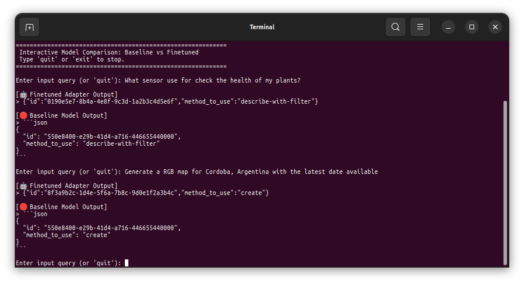

# CPU LoRA LLM Fine-Tuning Repo

Small, notebook-free repo for CPU-only LoRA fine-tuning of a Hugging Face causal language model.

Default model: `Qwen/Qwen3-0.8B`.

The repo intentionally separates three data groups:

- `data/manual/manual.jsonl`: examples you write by hand. By default these are added only to training.
- `data/augmented/augmented.jsonl`: examples already augmented elsewhere. This repo splits this file into train/val/test.
- `data/hard_test/hard_test.jsonl`: hard edge cases used only after training for final metrics.

The AI augmentation/generation step is intentionally **not** included.

## Example: Finetuned vs Baseline

The adapter shown in this example was finetuned using only **30 training examples**. The full training run took approximately **20 minutes** on a 2014 laptop equipped with **16 GB of DDR3 RAM** and an **Intel Core i7-4702MQ**, demonstrating that small LoRA experiments can be performed on modest, CPU-only hardware.

As shown in `reports/Comparison_example_Finetuned-vs-Baseline.png`, running `make chat` lets you interact with the finetuned and baseline models side-by-side. The small baseline LLM often struggles to produce raw, valid JSON without Markdown wrapping, while the finetuned model responds using the exact compact format requested:



*Figure: Interactive comparison between the finetuned adapter and the baseline model.*

## Makefile usage

For convenience, you can run tasks directly using the `Makefile` (which wraps the Docker commands and mounts necessary volumes, including `~/.cache` for models):

- `make build`: Builds the Docker image.
- `make train`: Runs the training pipeline using the default configuration.
- `make evaluate`: Evaluates the existing trained adapter.
- `make chat`: Starts an interactive REPL comparing the baseline model alongside your finetuned adapter (as shown in the example above).
- `make test`: Runs `pytest`.
- `make lint`: Runs `ruff check` on the source code.

## Data format

Each row is JSONL:

```json
{"id":"ex-001","instruction":"Classify sentiment.","input":"I love it.","output":"positive"}
```

`input` can be empty. Extra metadata fields are allowed and ignored by training.

## Quick start with Docker

Build:

```bash
docker build -t llm-finetune-cpu .
```

Train and evaluate:

```bash
docker run --rm -it \
  --env-file .env \
  -v "$(pwd)/data:/app/data" \
  -v "$(pwd)/outputs:/app/outputs" \
  -v "$(pwd)/reports:/app/reports" \
  llm-finetune-cpu train --config configs/default.yaml
```

Evaluate an existing adapter:

```bash
docker run --rm -it \
  --env-file .env \
  -v "$(pwd)/data:/app/data" \
  -v "$(pwd)/outputs:/app/outputs" \
  -v "$(pwd)/reports:/app/reports" \
  llm-finetune-cpu evaluate --config configs/default.yaml --adapter outputs/final_adapter
```


## Environment variables

Create or edit `.env` to cap data during workflow tests:

```bash
cp .env.example .env
# Then edit MAX_EXAMPLES. Empty or 0 means use all examples.
MAX_EXAMPLES=3
```

`MAX_EXAMPLES` limits each raw JSONL source before splitting: manual, augmented, and hard-test. Use `3` or more if you want the augmented split to keep train/val/test non-empty.

## Local run without Docker

```bash
python -m venv .venv
. .venv/bin/activate
pip install torch --index-url https://download.pytorch.org/whl/cpu
pip install -r requirements.txt
python -m llm_finetune train --config configs/default.yaml
```

## Outputs

Training writes:

- `outputs/checkpoints/`: step checkpoints
- `outputs/final_adapter/`: trained LoRA adapter
- `outputs/metrics/eval_summary.json`: baseline vs final metrics
- `outputs/metrics/log_history.json`: Trainer log history
- `reports/plots/training_loss.png`
- `reports/plots/eval_loss.png`
- `reports/plots/loss_improvement.png`
- `reports/plots/token_accuracy_improvement.png`

## Configuration

Edit `configs/default.yaml` to change:

- base model
- LoRA rank/alpha/dropout/target modules
- split ratios
- logging/evaluation frequency
- max length
- batch size and gradient accumulation

CPU fine-tuning is slow. Keep `max_length`, batch size, and epoch count conservative.

## Smoke test

For fast local validation without downloading the real model, use the tiny config:

```bash
python -m llm_finetune train --config configs/smoke.yaml
```

That config is for code-path testing only, not quality.
